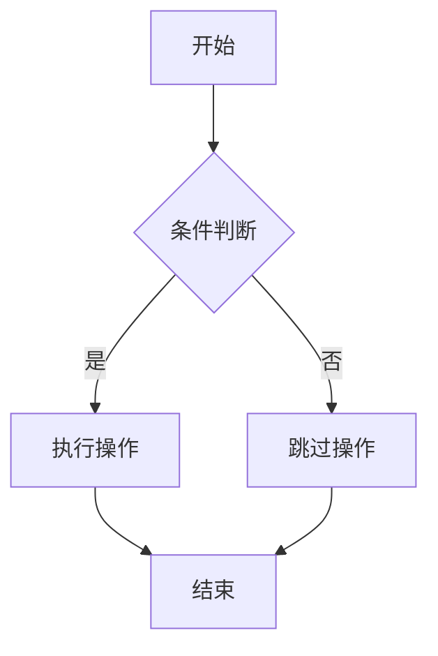
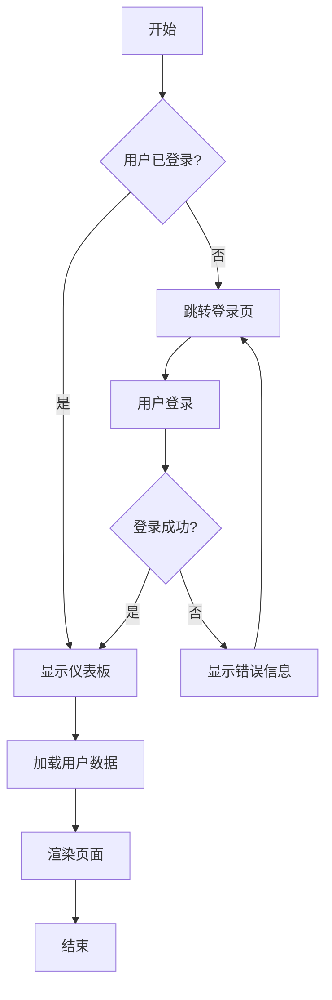
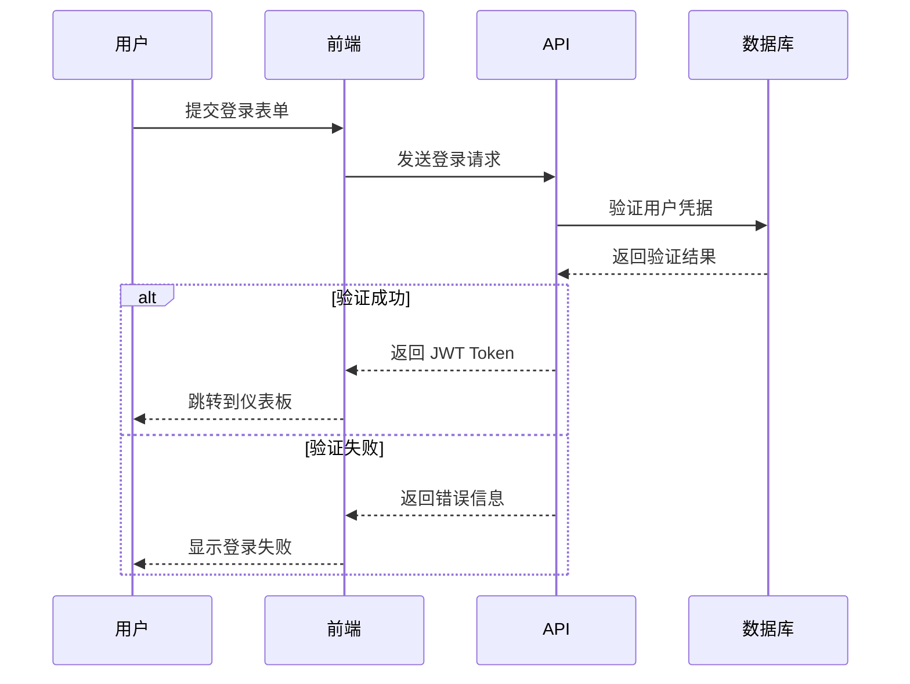
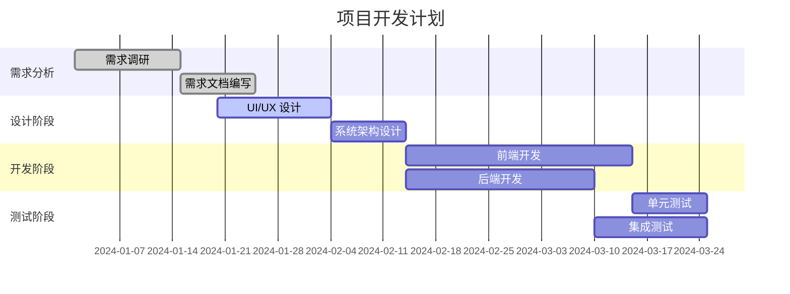
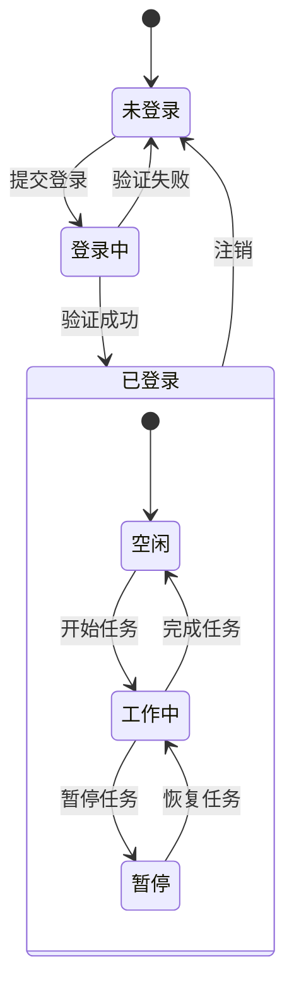
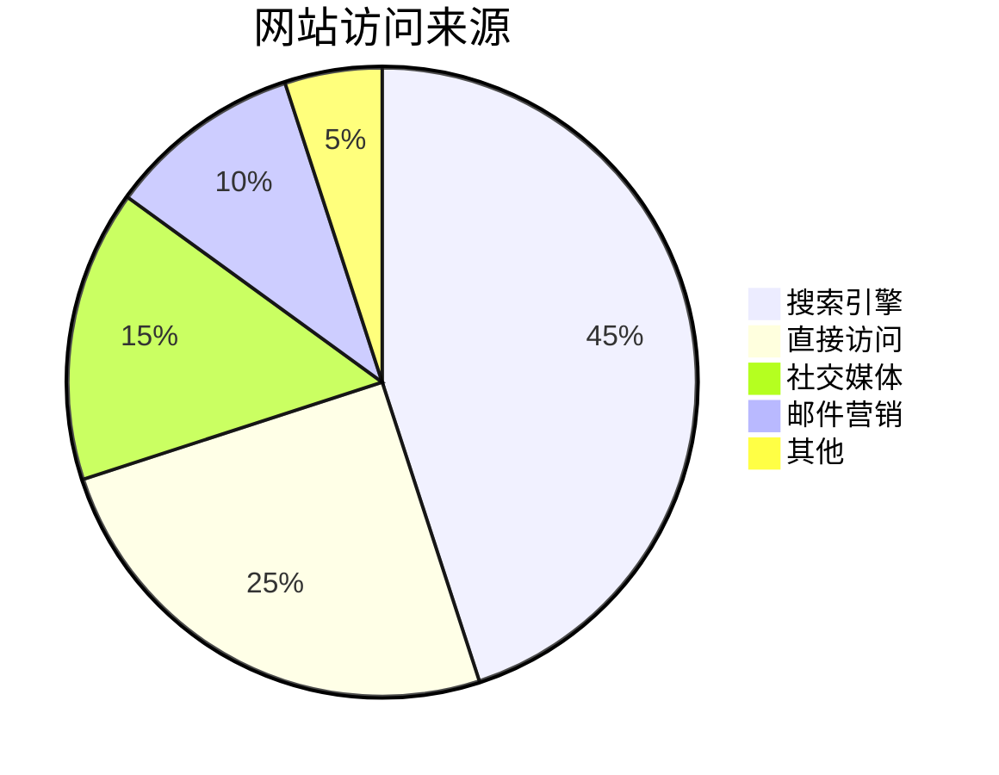

## 概述

Hugo 通过 **render hooks** 机制官方支持 Mermaid 图表渲染。这是 Hugo 核心功能的一部分，**不依赖特定主题**，可在任何 Hugo 站点中实现。

## 技术背景

- **Hugo 官方支持**：通过 Markdown render hooks 实现
- **主题无关**：适用于所有 Hugo 主题，不需要主题特定功能
- **渲染引擎**：使用官方 Mermaid JavaScript 库
- **按需加载**：仅在包含 Mermaid 图表的页面加载相关资源

## 实现步骤

### 1. 创建 Mermaid Render Hook

创建 `layouts/_markup/render-codeblock-mermaid.html`：

```html
<div style="text-align: center;">
  <pre class="mermaid">
    {{ .Inner | htmlEscape | safeHTML }}
  </pre>
</div>
{{ .Page.Store.Set "hasMermaid" true }}
```

### 2. 配置按需脚本加载

在 `layouts/partials/extend_footer.html` 中添加：

```html
{{- /* 按需加载 Mermaid 脚本 */ -}}
{{- if .Store.Get "hasMermaid" -}}
  <script type="module">
    import mermaid from 'https://cdn.jsdelivr.net/npm/mermaid/dist/mermaid.esm.min.mjs';
    mermaid.initialize({ startOnLoad: true });
  </script>
{{- end -}}
```

### 3. 使用语法

在 Markdown 文档中使用 ```mermaid 代码块：

````markdown

````

## 支持的图表类型

### 1. 流程图 (Flowchart)



### 2. 时序图 (Sequence Diagram)



### 3. 甘特图 (Gantt Chart)



### 4. 状态图 (State Diagram)




### 5. 饼图 (Pie Chart)




## 高级配置

### 自定义样式

可以通过 CSS 自定义 Mermaid 图表样式：

```css
.mermaid {
    background-color: #f8f9fa;
    border: 1px solid #e9ecef;
    border-radius: 8px;
    padding: 20px;
    margin: 20px 0;
}
```

### 主题配置

修改 Mermaid 初始化参数：

```javascript
mermaid.initialize({ 
    startOnLoad: true,
    theme: 'neutral',  // 可选: default, neutral, dark, forest
    themeVariables: {
        primaryColor: '#ff6b6b',
        primaryTextColor: '#fff',
        primaryBorderColor: '#ff4757',
        lineColor: '#5f27cd'
    }
});
```

## 性能优化

1. **按需加载**：脚本仅在包含 Mermaid 图表的页面加载
2. **CDN 缓存**：使用可靠的 CDN 服务提供商
3. **版本锁定**：指定具体版本号避免意外更新

## 常见问题

### 图表不显示
1. 检查代码块语言标识符是否为 `mermaid`
2. 确认 render hook 文件路径正确
3. 检查浏览器控制台是否有 JavaScript 错误

### 样式问题
1. 确认 CSS 加载顺序
2. 检查主题是否覆盖了 Mermaid 样式
3. 使用浏览器开发者工具调试样式

## 参考资料

- [Hugo Diagrams 官方文档](https://gohugo.io/content-management/diagrams/)
- [Mermaid 官方文档](https://mermaid.js.org/)
- [Mermaid 语法参考](https://mermaid.js.org/syntax/flowchart.html)
